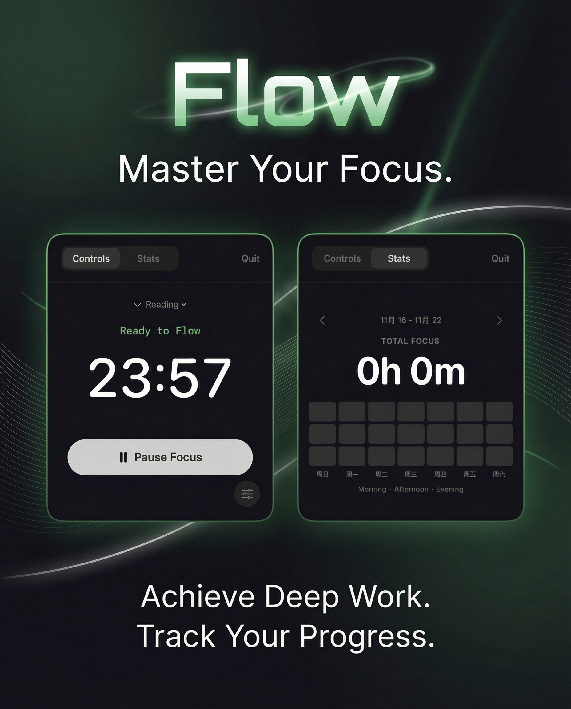

# Flow - Master Your Focus

<p align="center">
  
</p>

Flow 是一个极简主义的番茄钟应用，旨在帮助你进入心流状态，实现深度工作。
Flow is a minimalist Pomodoro timer designed to help you achieve flow state and deep work.

## ✨ Features / 功能特性

*   **Focus Timer / 专注计时**: 经典的 25 分钟专注模式，支持自定义时长。 Classic 25-minute focus mode with customizable duration.
*   **Flow Animations / 沉浸动效**: 呼吸般的背景与流光文字，助你平复心境。 Breathing backgrounds and shimmering text to calm your mind.
*   **Statistics / 数据统计**: 详细的热力图记录你的每一次专注，见证点滴进步。 Detailed heatmap tracks every session, witnessing your progress.
*   **Tag System / 标签系统**: 为任务分类（Reading, Coding, Meeting 等），清晰管理时间。 Categorize tasks (Reading, Coding, Meeting, etc.) for clear time management.
*   **Minimalist UI / 极简界面**: 无干扰的暗色模式设计，完美适配 macOS。 Distraction-free dark mode design, perfectly adapted for macOS.

## 📥 Installation / 安装

1.  Download the latest `.dmg` file from the [Releases](https://github.com/weijue/TomatoClock/releases) page.
2.  Open `Flow.dmg`.
3.  Drag `Flow.app` into the `Applications` folder.
4.  Start your flow journey!

1.  从 [Releases](https://github.com/weijue/TomatoClock/releases) 页面下载最新的 `.dmg` 文件。
2.  打开 `Flow.dmg`。
3.  将 `Flow.app` 拖入 `Applications` 文件夹。
4.  开启你的心流之旅！

## 🚀 Usage / 使用方法

1.  **Start Focus / 开始专注**: Click the "Start Focus" button. The interface will glow to indicate you are in flow mode. 点击 "Start Focus" 按钮，界面将泛起微光，提示你已进入心流模式。
2.  **Switch Mode / 切换模式**: Use the top tab bar to switch between "Controls" (Timer) and "Stats" (History). 使用顶部标签栏在 "Controls"（计时）和 "Stats"（统计）之间切换。
3.  **Select Tag / 选择标签**: Click the tag menu above the timer to choose your current activity type. 点击计时器上方的标签菜单，选择当前活动的类型。
4.  **Settings / 设置**: Click the slider icon in the bottom right to adjust timer durations and sound preferences. 点击右下角的滑块图标，调整计时时长和声音设置。

## 🛠 Development / 开发

```bash
# Clone the repository
git clone https://github.com/weijue/TomatoClock.git

# Build the project
swift build -c release

# Package the app
./package_app.sh
```

---
Designed with ❤️ for deep workers.
