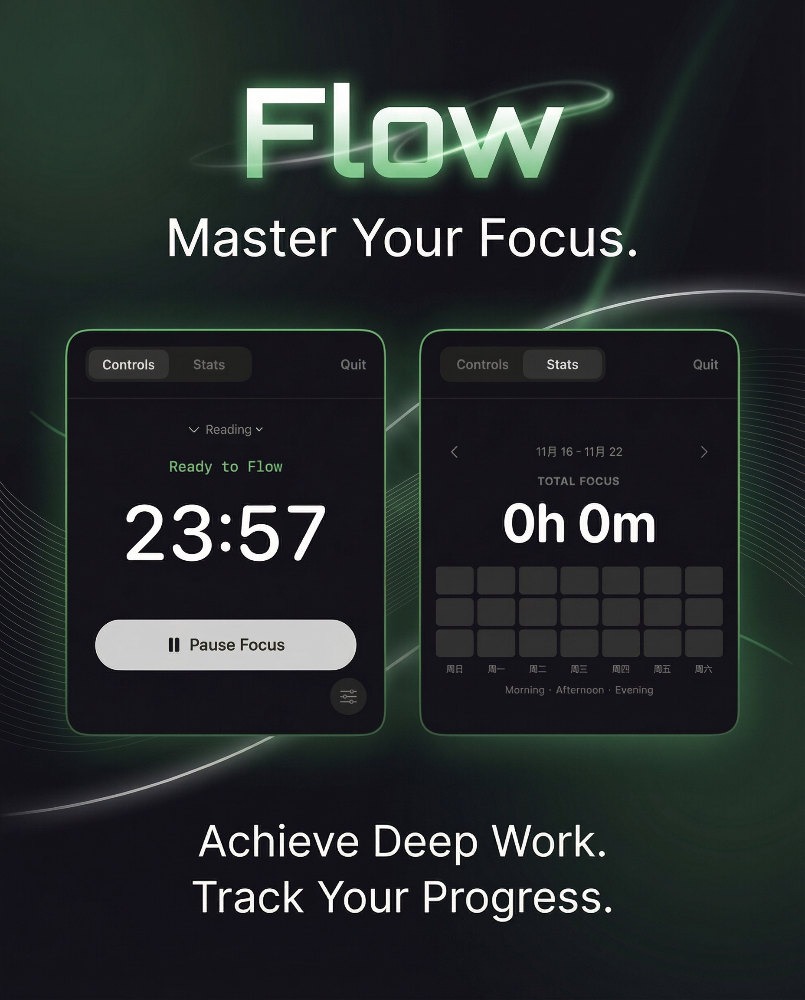

# Flow - Master Your Focus

<div align="center">

[**中文**](README_CN.md) | [**English**](README.md)



</div>

Flow is a minimalist Pomodoro timer designed to help you achieve flow state and deep work.

## ✨ Features

*   **Focus Timer**: Classic 25-minute focus mode with customizable duration.
*   **Flow Animations**: Breathing backgrounds and shimmering text to calm your mind.
*   **Statistics**: Detailed heatmap tracks every session, witnessing your progress.
*   **Tag System**: Categorize tasks (Reading, Coding, Meeting, etc.) for clear time management.
*   **Minimalist UI**: Distraction-free dark mode design, perfectly adapted for macOS.
*   **Floating Ball**: A beautiful floating countdown ball with green glow effect.
*   **Auto Update**: Built-in update notification with one-click update via Sparkle.

## 📥 Installation

1.  Download the latest `.dmg` file from the [Releases](https://github.com/MuQY1818/Flow/releases) page.
2.  Open `Flow.dmg`.
3.  Drag `Flow.app` into the `Applications` folder.
4.  Start your flow journey!

Since this app is not signed with an Apple Developer ID (I'm an individual developer without the $99/year certificate 🥲), macOS Gatekeeper might block it. 

**To fix this:**
1.  Open `Terminal`.
2.  Run the following command:
    ```bash
    sudo xattr -rd com.apple.quarantine /Applications/Flow.app
    ```
3.  Or simply **Right-click** the app -> Select **Open** -> Click **Open** in the dialog.

## 🚀 Usage

1.  **Start Focus**: Click the "Start Focus" button. The interface will glow to indicate you are in flow mode.
2.  **Switch Mode**: Use the top tab bar to switch between "Controls" (Timer) and "Stats" (History).
3.  **Select Tag**: Click the tag menu above the timer to choose your current activity type.
4.  **Settings**: Click the slider icon in the bottom right to adjust timer durations and sound preferences.
5.  **Right-Click Menu**: Right-click the menu bar icon to:
    - Show/Hide floating ball
    - Switch menu bar style (compact/capsule)
    - Check for updates

## 🛠 Development

```bash
# Clone the repository
git clone https://github.com/MuQY1818/Flow.git

# Build the project
swift build -c release

# Package the app
./package_app.sh
```

---
Designed with ❤️ for deep workers.
